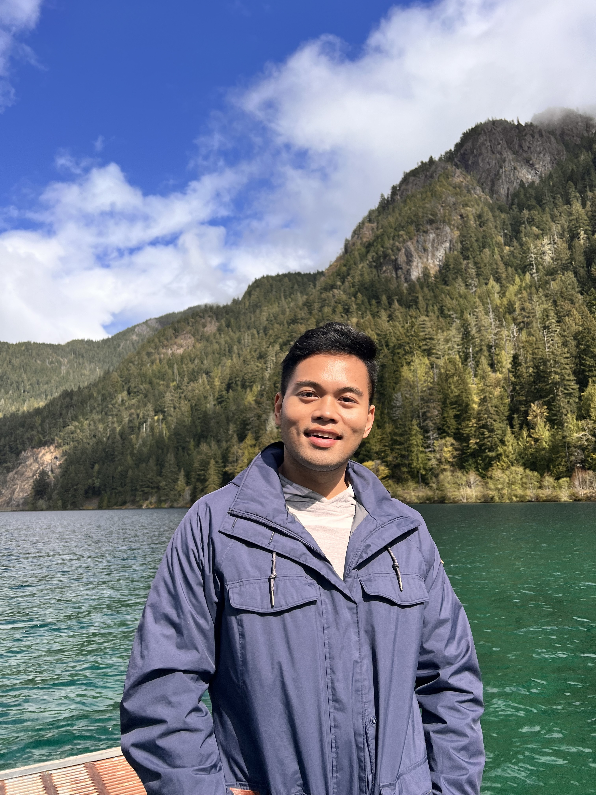

# Jeff Remo, MPH Candidate

## Public health leader advancing sexual health equity

Hi, I'm Jeff Remo (he/they) — a public health practitioner and 2nd-year MPH student at Columbia University's Mailman School of Public Health, in the Heilbrunn Department of Population and Family Health with a focus in Health Communication.

My career has centered on **HIV/STI prevention, PrEP access, and LGBTQ+ health equity** — from launching Hawai'i's first PrEP navigation program, to serving as an HIV/STI Disease Intervention Specialist during the 2022 MPOX outbreak, to leading sexual health communication campaigns reaching thousands of community members. I currently mentor emerging HIV advocates nationally through NMAC's NextGen Fellowship and provide direct sexual health education to youth through Project STAY.

This site is a portfolio of that work: the programs I've built, the campaigns I've led, and the resources I've created in service of sexual health equity.

<a href="sexual-health.html" class="btn btn-primary" style="margin-right:10px;">Explore My Sexual Health Leadership &raquo;</a>
<a href="https://drive.google.com/drive/folders/1JKWGP3zoSb81X0lbf1dDWq6UV6kA8a00" class="btn btn-default" target="_blank">View Full Resource Archive</a>

---

### At a Glance

- **300%** — enrollment growth achieved in year one of the PrEP navigation program I launched at the Hawai'i Health & Harm Reduction Center
- **200+** — individuals newly diagnosed with HIV or syphilis I provided direct partner services and linkage to care for as a Disease Intervention Specialist
- **30** — emerging HIV advocates I mentor nationally as an NMAC NextGen Fellowship Emerging Leadership Champion
- **10,000+** — impressions generated by sexual health messaging campaigns I designed for the Colorado Department of Public Health & Environment

---

### Explore My Work

**[Sexual Health Leadership &raquo;](sexual-health.html)**
Campaigns, programs, and resources I've built to advance HIV/STI prevention and sexual health equity, drawn from my [Google Drive portfolio](https://drive.google.com/drive/folders/1JKWGP3zoSb81X0lbf1dDWq6UV6kA8a00).

**[Experience & Leadership &raquo;](about.html)**
My professional journey, academic leadership at Columbia, and full resume.

**[Data Science Work &raquo;](Dashboard.html)**
Data visualization and analysis work from my MPH coursework.
