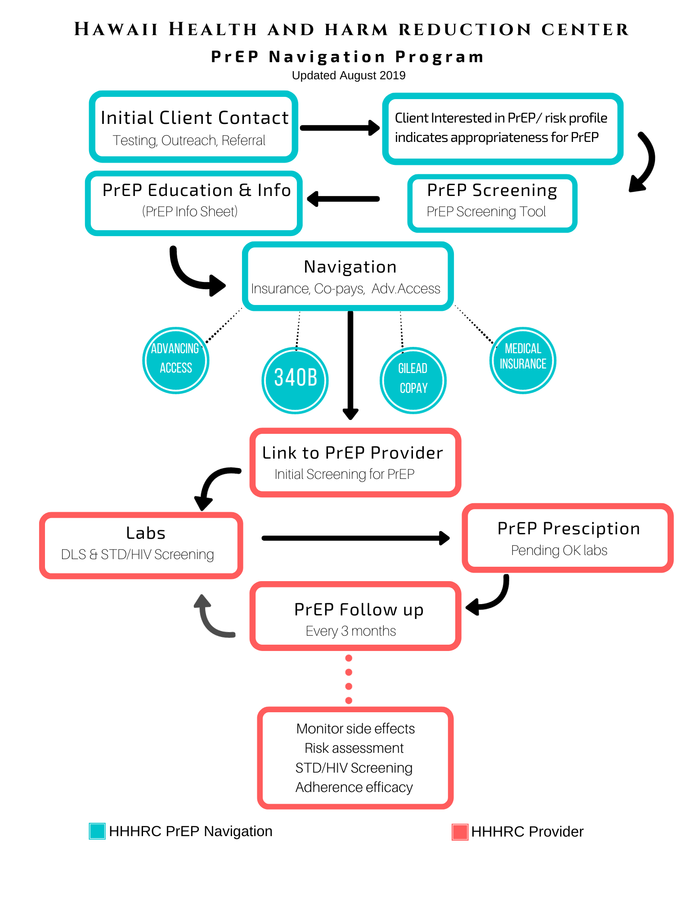
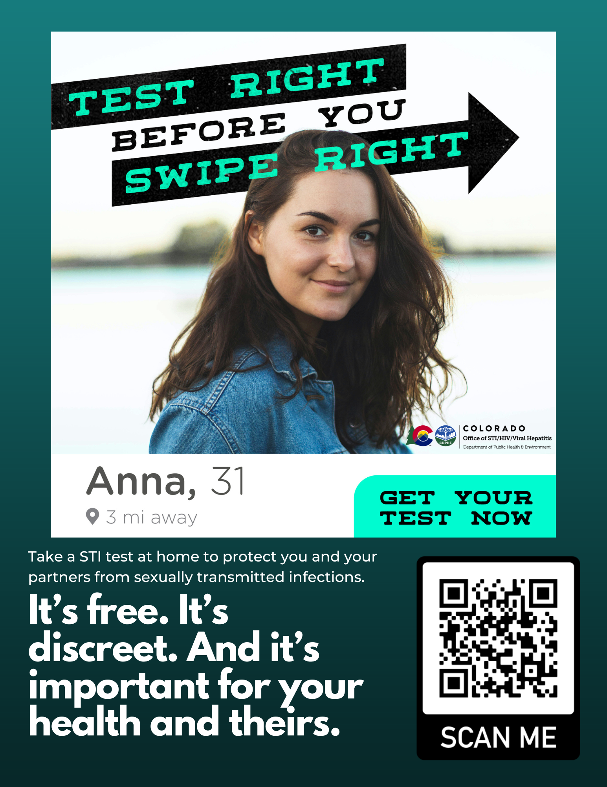
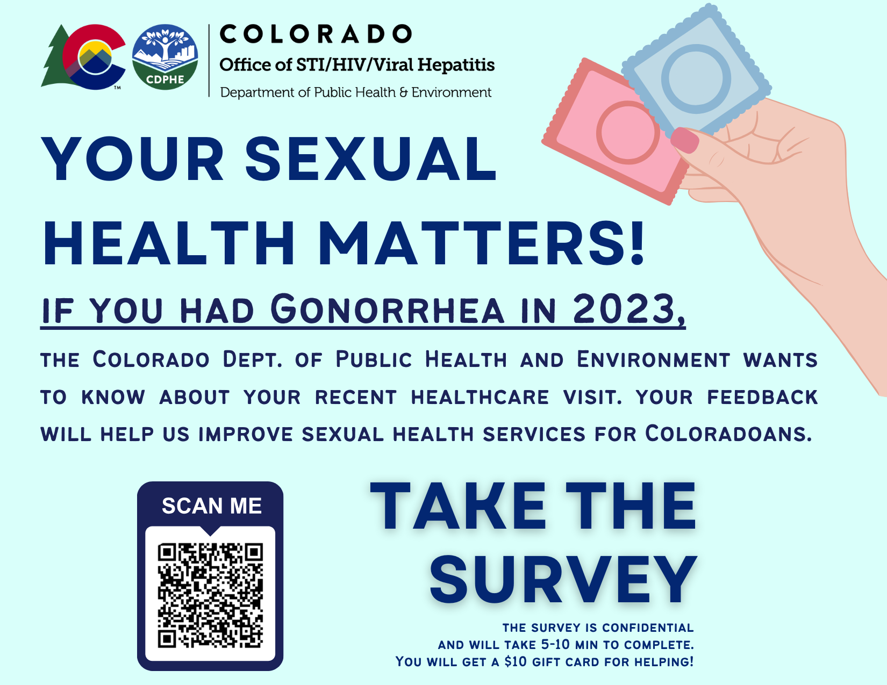

## Leading Sexual Health Innovation

Sexual health equity — particularly HIV and STI prevention among LGBTQ+ communities and communities of color — has been the throughline of my public health career. Below is a portfolio of the programs, campaigns, and thought leadership I've built, drawn directly from my working files. The complete, original documents are hosted in my [Google Drive resource archive](https://drive.google.com/drive/folders/1JKWGP3zoSb81X0lbf1dDWq6UV6kA8a00){target="_blank"} and linked throughout this page.

---

## Building PrEP Access: Hawai'i's First PrEP Navigation Program

In 2017, I launched Honolulu's first PrEP navigation program at the **Hawai'i Health & Harm Reduction Center**, in partnership with the Hawai'i Department of Health and the state's only public STI clinic. At the time, patients interested in HIV prevention routinely left provider visits empty-handed. I built a navigation pathway — from outreach and screening through insurance/co-pay assistance, prescribing, and quarterly follow-up — that made biomedical HIV prevention accessible to the people who needed it most.

The program **exceeded its enrollment targets by 300% in its first year.**

HHHRC PrEP Navigation Program workflow (2019) — from initial client contact through quarterly PrEP follow-up. <a href="https://drive.google.com/file/d/1kmYgxS68820MwxK_Drbjz2ujbrGOBnF1/view" target="_blank">View original</a>

I also developed patient-facing education materials, including a plain-language [PrEP infographic](https://drive.google.com/file/d/1QE7kndWk368PCurw3DWGfej7ussBulob/view){target="_blank"} covering eligibility, effectiveness, cost, and side effects — designed to reduce barriers to a first conversation about PrEP.

---

## Meeting Communities Where They Are: Dating App STI Testing Campaign

As an HIV/STI Disease Intervention Specialist and later Public Health Preparedness & Response Coordinator with the **Colorado Department of Public Health & Environment**, I co-designed a bilingual (English/Spanish) sexual health messaging campaign, *"Test Right Before You Swipe Right,"* targeting users of location-based dating apps with free, discreet at-home STI testing. The campaign generated **over 10,000 social media impressions** and reflects a core belief of mine: effective public health meets people in the digital spaces where risk and connection actually happen.

Campaign creative for CDPHE's Office of STI/HIV/Viral Hepatitis. Full English/Spanish creative set available in the <a href="https://drive.google.com/drive/folders/1bnaHoAnhVP-ZbttY4s2pQADA3xWTygVe" target="_blank">Drive portfolio folder</a>.

I extended this work with a statewide patient-feedback survey campaign (English/Spanish) following gonorrhea diagnoses, designed to capture patient experience data and improve sexual health service delivery for Coloradans.

---

## Outbreak Response Communication

During the 2022 MPOX outbreak, I helped build first-responder training curricula for contact tracing and case investigation, and co-developed the **CDPHE Office of STI/HIV/Viral Hepatitis Outbreak Communication Plan** — a framework governing how the office detects, confirms, responds to, and reports out on HIV, STI, and viral hepatitis outbreaks and clusters, including molecular HIV surveillance, stakeholder communication, and interagency training.

[View the Outbreak Communication Plan (PDF) &raquo;](https://drive.google.com/file/d/1pRcryEGGSOv60j1NV5SPnUudXGESuOlD/view){target="_blank"}

---

## Public Health Storytelling

Communicating sexual health accurately, empathetically, and without stigma is central to how I practice public health. Below is a short piece of public health storytelling I produced.

<iframe src="https://drive.google.com/file/d/1cB8KrqFvYxs7DmpvdZPTGxsPa9fWLYlP/preview" style="position:absolute; top:0; left:0; width:100%; height:100%; border:0;" allow="autoplay" allowfullscreen></iframe>

---

## Writing & Advocacy

- **["Either the Gays Need to Be Stopped, or Public Health Needs to Catch Up"](https://drive.google.com/file/d/1hGROECMMVcjAZDjx4_EwV8LOYao4oixy/view){target="_blank"}** — an op-ed arguing that public health infrastructure must modernize disease intervention for the dating-app era, drawing on my own DIS casework and rising STI rates among young adults.
- **[Graduate Statement of Purpose](https://docs.google.com/document/d/1F2GMomXivoioHEd9lVhBLFjKl_Ag1LY0J2l5mHeId8A/edit?usp=sharing){target="_blank"}** — on building the Hawai'i PrEP navigation program and my commitment to LGBTQ+ sexual health equity, including work toward the WHO's goal to end AIDS by 2030.
- **[NMAC Youth Champion Mentorship Writing Sample](https://drive.google.com/file/d/1AVzvKmen0a8adWuBAXNyI4hkXHavB3fH/view){target="_blank"}** — supporting my role mentoring 30 emerging HIV advocates nationally through the NMAC NextGen Fellowship.

---

## Community Fundraising & Engagement

I've also led fundraising and communications efforts supporting direct HIV services, including the **[Honolulu AIDS Walk Sponsorship Guide](https://drive.google.com/file/d/1dnSF4xaofLA6qPNaSBzeJJwKIYpEbJrT/view){target="_blank"}**, which I helped develop to fund rapid HIV testing, PrEP counseling and linkage, case management, and HIV medical care for the Honolulu community — securing $20K in event funding through grant writing and stakeholder partnerships.

---

## Explore the Full Archive

Every resource above — along with additional campaign materials, planning documents, and my CV — lives in my Google Drive portfolio.

<a href="https://drive.google.com/drive/folders/1JKWGP3zoSb81X0lbf1dDWq6UV6kA8a00" class="btn btn-primary" target="_blank">Open the Google Drive Portfolio &raquo;</a>
